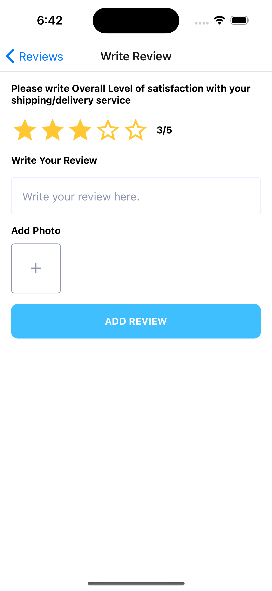

# e-commerce-app

An E-commerce mobile app shows the list of products, product details, customer reviews, checkout process, user profile, and authentication screens.

## Screenshots

Login Screen

Register Screen

Home Screen

Product Details Screen

Review Screen

Write Review Screen

Favorite Screen

Notification Screen

Notification Offer Screen

Notification Feed Screen

Notification Activity Screen

Explore Screen

Search Products Screen

Cart Screen

Ship To Address Screen

Add Address Screen

Payment Screen

Order Success Screen

Order Screen

Order Details Screen

Account Screen

Profile Screen

Edit Profile Screen

Change Password Screen

Address Screen

Add Card Screen

