# e-commerce-app

An E-commerce mobile app shows the list of products, product details, customer reviews, checkout process, user profile, and authentication screens.

## Screenshots

Login Screen

Register Screen

Home Screen

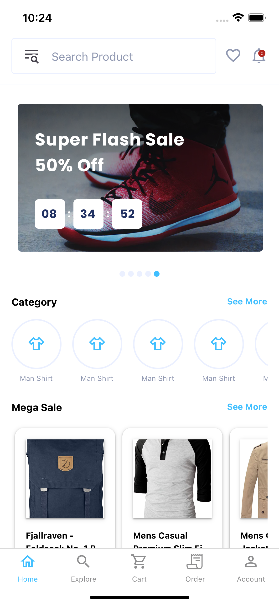

Product Details Screen

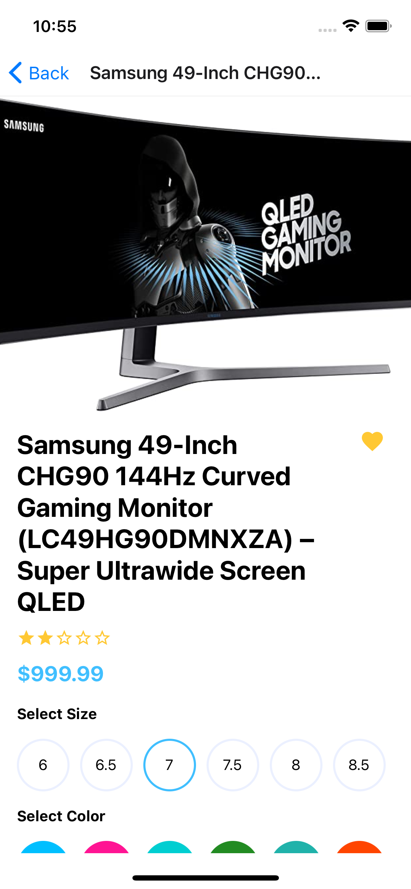
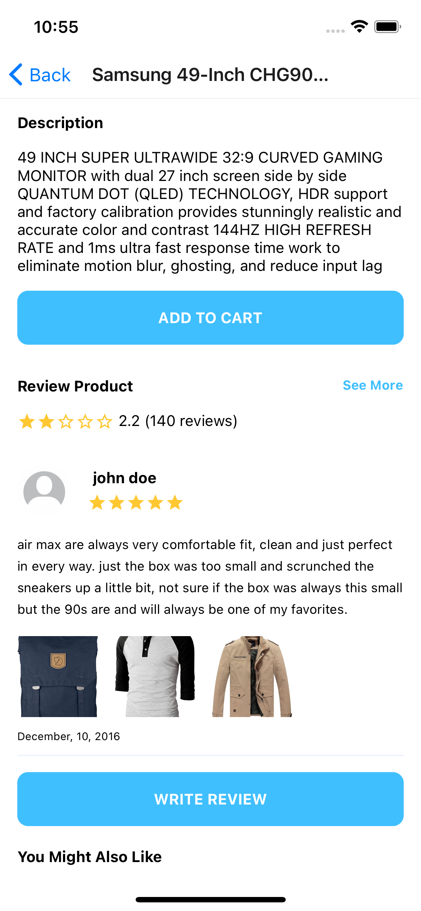

Review Screen

Write Review Screen

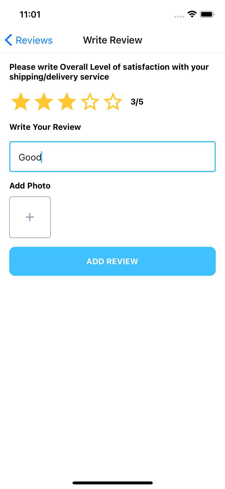

Favorite Screen

Notification Screen

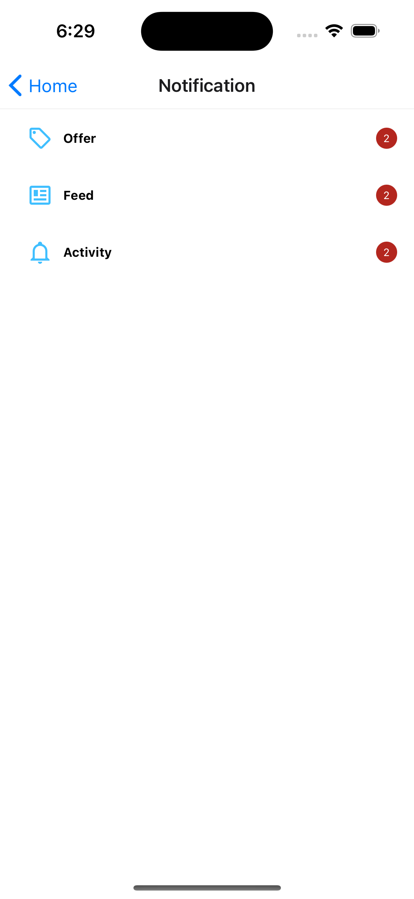

Notification Offer Screen

Notification Feed Screen

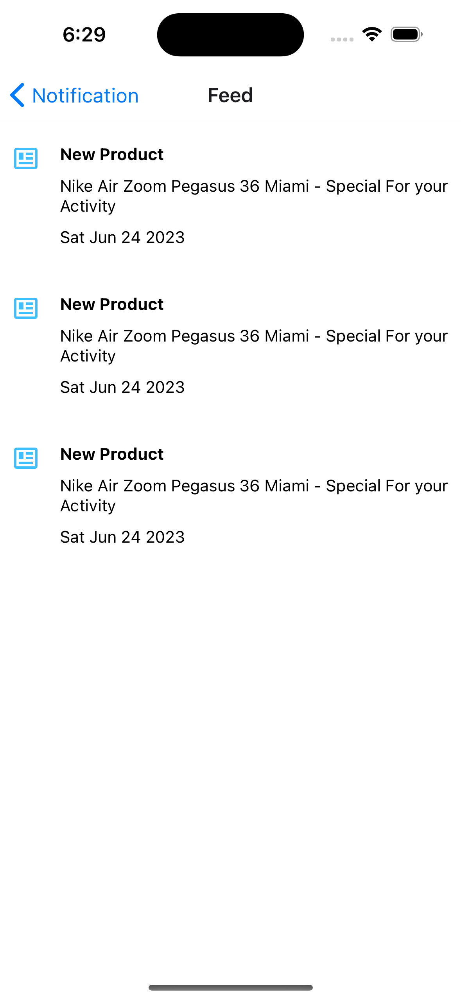

Notification Activity Screen

Explore Screen

Search Products Screen

Cart Screen

Ship To Address Screen

Add Address Screen

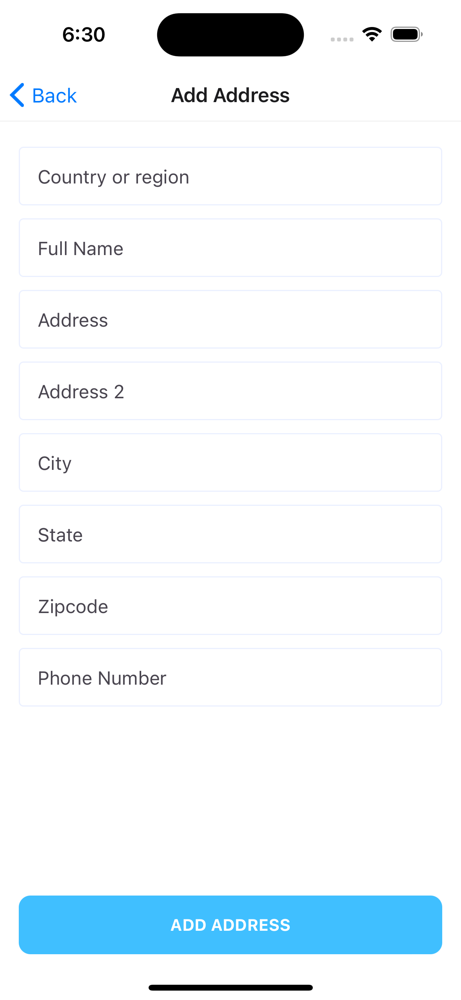

Payment Screen

Order Success Screen

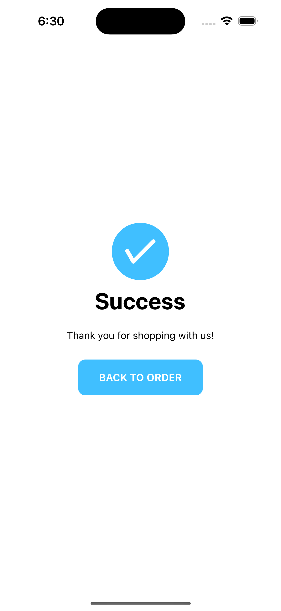

Order Screen

Order Details Screen

Account Screen

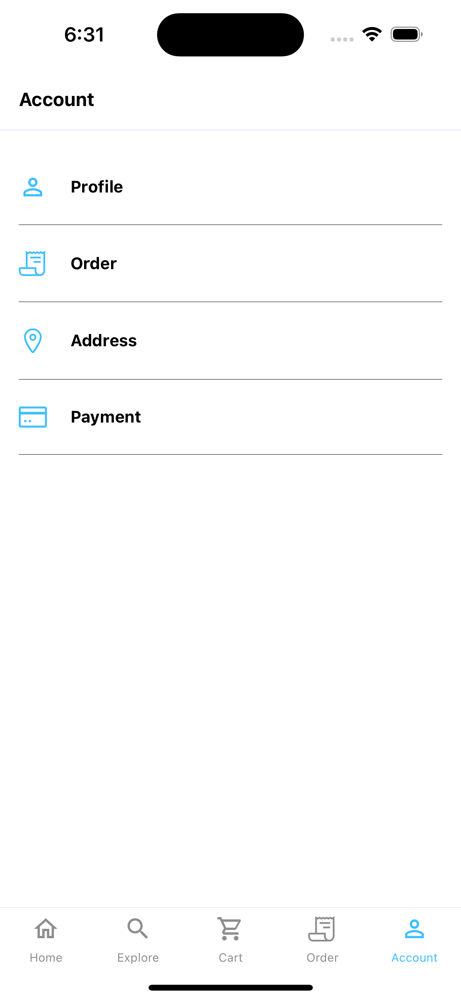

Profile Screen

Edit Profile Screen

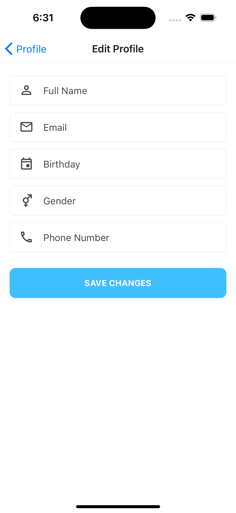

Change Password Screen

Address Screen

Add Card Screen

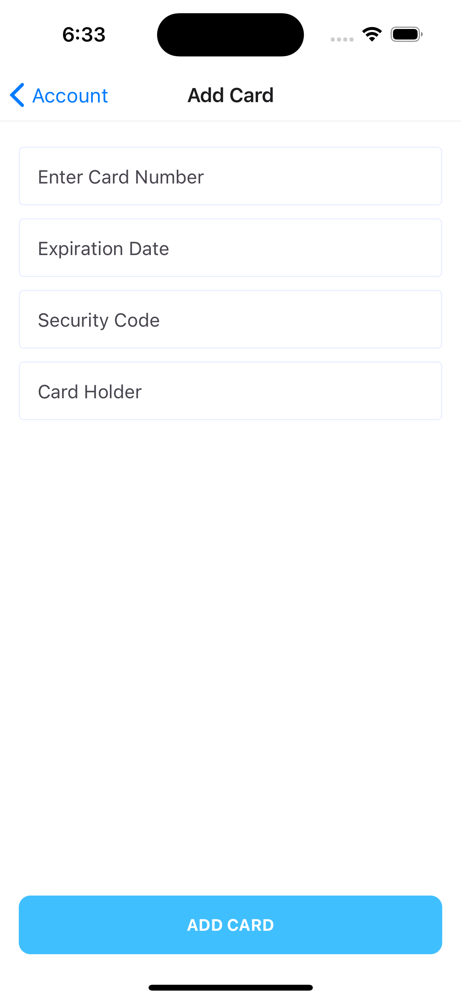
